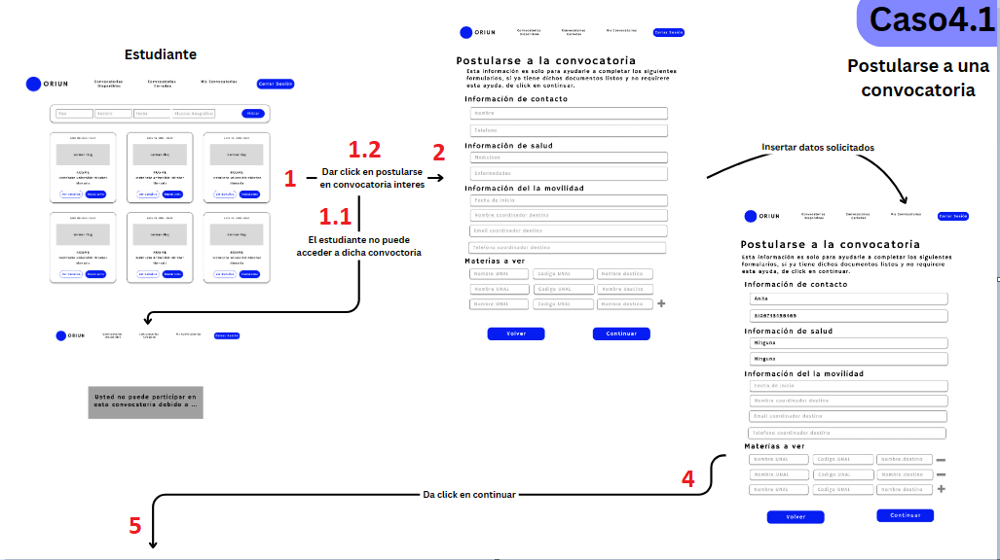

# Endpoints for Case 4

## 3. Check if student is eligible for an application
**URL:** `student/eligible/`

**Method:** `GET`

**Description:** Used to know if a student can apply to a call or not. If not, the endpoint will tell you the reason (therefor you can just show it to the student). So, if the `eligibility` is `false` then you should show the user the message, if it is `true` then the user can continue the process (applying to a call).

**Authorization:** the bearer token of the user 

**Inputs:** query params 

| Name       | Type    | Description                                |
|------------|---------|--------------------------------------------|
| `call`     | Integer | ID of the call the student wants to apply. |

**Outputs:**

| Name          | Type    | Description                                                                                                                      |
|---------------|---------|----------------------------------------------------------------------------------------------------------------------------------|
| `eligibility` | Boolean | True if the user can apply to the call (therefor can continue) or False otherwise.                                               |
| `message`     | String  | Let's the user know the reason of not being able to apply to the call (in other words, when `elibility` is `true` this is empty. |

## 4. Get initial information about the student
**URL:** `student/info-application/`

**Method:** `GET`

**Description:** Used to know initial information that will be used into the application, such as the contact person information, medicines or diseases the student might have, also the information of their coordinator.

**Authorization:** the bearer token of the user 

**Inputs:** None

**Outputs:**

| Name               | Type   | Description                                                                                                                                               |
|--------------------|--------|-----------------------------------------------------------------------------------------------------------------------------------------------------------|
| `contact_person`   | JSON   | Information of the contact person for the student. It might be `null`, in that case it means the student does not have any information in this field yet. |
| `diseases`         | String | Diseases the student might have, it can also be `null`, if so it indicates that the user does not have a disease or it has not been set.                  |
| `medication`       | String | Medication the student might take, it can also be `null`, if so it indicates that the user does not take any medication or it has not been set.           |
| `info_coordinator` | JSON   | Information about the coordinator of the student, this is where they will send the documents so they can be signed.                                       |

`contact_person`:

| Name           | Type    | Description                                                      |
|----------------|---------|------------------------------------------------------------------|
| `id`           | Integer | Identifier of the contact person, do not show it to the student. |
| `name`         | String  | Name of the contact person                                       |
| `last_name`    | String  | Last name of the contact person                                  |
| `email`        | String  | Email of the contact person                                      |
| `relationship` | String  | Relationship of the contact person                               |
| `cellphone`    | String  | Cellphone of the contact person                                  |

`info_coordinator`:

| Name                             | Type   | Description                              |
|----------------------------------|--------|------------------------------------------|
| `Coordinador Curricular`         | String | Name of the curricular coordinator.      |
| `Teléfono Coordinador`           | String | Telephone of the curricular coordinator. |
| `Correo Coordinador`             | String | Email of the curricular coordinator.     |
| `Correo Coordinación Curricular` | String | Name of the curricular coordination.     |

## 5. Get region of the call
**URL:** `application/region_call/`

**Method:** `GET`

**Description:** Used to know the region of the call, this is used to know which docs will be needed and therefor which interface must be presented to the student.

**Authorization:** the bearer token of the user 

**Inputs:** query params 

| Name       | Type    | Description                                |
|------------|---------|--------------------------------------------|
| `call`     | Integer | ID of the call the student wants to apply. |

**Outputs:**

| Name     | Type   | Description                                                                                      |
|----------|--------|--------------------------------------------------------------------------------------------------|
| `region` | String | Region of the call. There are 3 possibles strings: `Uniandes`, `Nacional`, and `Internacional` . |

Which information should the student give?

### Informacion de contacto
- Nombre
- Apellido
- Email
- Relacion (que relacion tiene con el estudiante)
- Telefono

### Informacion de salud
- Enfermedades
- Medicamentos

### Informacion Institucion de destino
- Nombre facultado de destino
- Nombre programa de destino
- Nombre del contacto en la institucion
- Cargo del contacto en la institucion
- Telefono del contacto en la institucion
- Correo del contacto en la institucion

### Informacion movilidad
- Fecha de inicio (dia-mes-año)
- Fecha de finalizacion (dia-mes-año)

### Informacion de los cursos
- Codigo UNAL, Nombre UNAL, codigo destino, nombre destino

These are the documents that all student must submit (base case):
- Formato de solicitud
- Formato de responsabilidad nacional
- Tratamiento de datos personales
- Documento de identidad
- Certificado de notas
- Otros documentos (here the student can upload any document that the university might require)

What types of regions are there and what should be display for each one?
1. Uniandes:
    - Same as the base case
2. Internacional:
    - Carta de motivacion
    - Pasaporte
    - Certificado del idioma
    - Carta demostrando suficiencia economica
3. Nacional:
    - Documento 'sigueme' 
    - Certificado de matricula
    - Certificado afiliacion EPS 
    - Carta demostrando suficiencia economica

Which documents can only have a submit button?
- Documento de identidad
- Certificado de notas
- Otros documentos (here the student can upload any document that the university might require)
- Carta de motivacion
- Pasaporte
- Certificado del idioma
- Carta demostrando suficiencia economica
- Certificado de matricula
- Certificado afiliacion EPS

Workflow:

1. Vas a llamar el endpoint 3 (Check if student is eligible for an application) y segun eso habran dos opciones:

   1.1: `eligibility` es falso, por ende le muestras esa vista del error y en el mensaje pones lo que se retorno de `message`.

   1.2: `eligibility` es verdadero, por ende puedes seguir con el paso 2
2. Vas a llamar al endpoint 4 (Get initial information about the student), segun los datos que te retorne, vas a llenar la informacion de contacto o la informacion de salud.
3. 
4. El usuario llenará el resto de datos, y una vez de click en continuar revisaras que la informacion de contacto este llena, bien sea por que yo te pase ese dato en el anterior endpoint o porque la persona lo lleno.
5. Llamaras  al endpoint 5 (Get region of the call) y segun la region que te arroje tendras una vista diferente en el siguiente paso (que puedes ver Canva para tener una idea de como es). Además, parte del endpoint 4 te dara la informacion de la coordinacion curricular, eso lo debes incluir en esa siguiente vista, pues ahi sera a donde los estudiantes envien algunos de esos documentos.

'''
 Facultad: DEST_FACULTY 
 Programa Curricular: DEST_PROGRAM
 Contacto en la Institución: DEST_CONTACT_NAME
 Cargo del Contacto: DEST_CONTACT_CHARGE
 Teléfono del Contacto: DEST_CONTACT_PHONE
 Correo del Contacto: DEST_CONTACT_EMAIL
 '''

# TODO: add is_extension to front