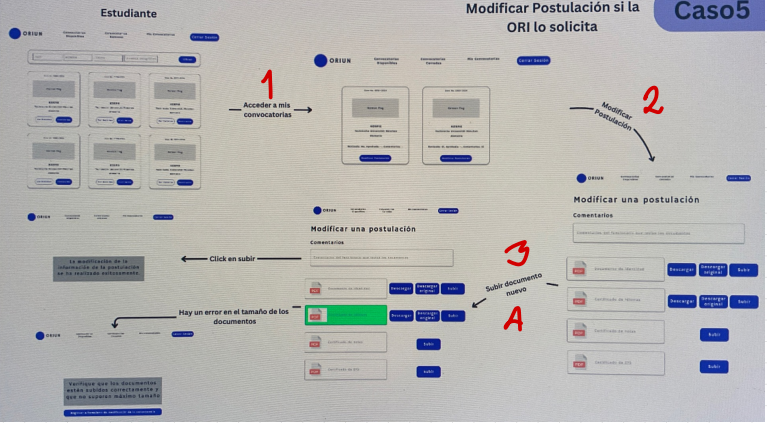

# Endpoints for Case 5

## 1. Get applications of student

**URL:** `application/student/`

**Method:** `GET`

**Description:** Used to get all the applications the student has, and their status.

**Authorization:** the bearer token of the user 

**Inputs:** None

**Outputs:** list where each JSON consists of:

| Name                 | Type            | Description                                                                                                                                                                                                                                                                           |
|----------------------|-----------------|---------------------------------------------------------------------------------------------------------------------------------------------------------------------------------------------------------------------------------------------------------------------------------------|
| `call`               | Integer         | Id of the call.                                                                                                                                                                                                                                                                       |
| `university_name`    | String          | Name of the university.                                                                                                                                                                                                                                                               |
| `university_country` | String          | Country of the university.                                                                                                                                                                                                                                                            |
| `approve_documents`  | null or boolean | It indicated whether an employee has check the documents, if it is `null` it means the documents have not been checked, if it is `true` then it means the docs have been approved and if it is `false` then the docs were disproved. This can be shown with a color, instead of text. |
| `approved`           | null or boolean | It indicated whether an employee has approved the application, in other words if the student won the mobility or not, the idea with `null` and the boolean values is the same as the previous one.                                                                                    |

## 2. Get region of the call

**URL:** `application/region_call/`

**Method:** `GET`

**Description:** Used to know the region of the call, this is used to know which docs will be needed and therefor which interface must be presented to the student. At the end of file is the list with the names of each possible file in each region.

**Authorization:** the bearer token of the user 

**Inputs:** query params 

| Name       | Type    | Description                                 |
|------------|---------|---------------------------------------------|
| `call`     | Integer | ID of the call the student wanted to apply. |

**Outputs:**

| Name     | Type   | Description                                                                                      |
|----------|--------|--------------------------------------------------------------------------------------------------|
| `region` | String | Region of the call. There are 3 possibles strings: `Uniandes`, `Nacional`, and `Internacional` . |

## 3. Comments of the application

**URL:** `application/comments/`

**Method:** `GET`

**Description:** Used to get the comments made by the employee about the documents submited by the student.

**Authorization:** the bearer token of the user 

**Inputs:** query params 

| Name       | Type    | Description                                 |
|------------|---------|---------------------------------------------|
| `call`     | Integer | ID of the call the student wanted to apply. |

**Outputs:**

| Name           | Type   | Description                                                                                                                     |
|----------------|--------|---------------------------------------------------------------------------------------------------------------------------------|
| `comment_docs` | String | Comment from the employee, if there were no comments, then it shows "No hay comentarios con respecto a los documentos subidos". | 

## 4. Get a document

**URL:** `application/download/`

**Method:** `GET`

**Description:** Returns a public link that can be used during 15 minutos to download the requested document.

**Authorization:** the bearer token of the user 

**Inputs:** query params 

| Name        | Type    | Description                                                                                                                                                              |
|-------------|---------|--------------------------------------------------------------------------------------------------------------------------------------------------------------------------|
| `call`      | Integer | ID of the call the student wants to apply.                                                                                                                               |
| `type_file` | String  | If the student wants to download the filled document or the original documents. If it is the first case, then it must be equal to `filled_doc` otherwise `original_doc`. |
| `name_file` | String  | Name of the document the student wants to download. Each document has an specific name, this information is at the end of the document.                                  |

**Outputs:**
    
| Name   | Type   | Description                                            |
|--------|--------|--------------------------------------------------------|
| `link` | String | Public link that can be used to download the document. |

**Exceptions:**

If the file is not found you will get a 404 status and a message "form not found". 

## 5. Replace a document

**URL:** `application/edit/`

**Method:** `PUT`

**Description:** Replaces a file on GCP.

**Authorization:** the bearer token of the user 

**Inputs:** body 

| Name        | Type    | Description                                                                                                                             |
|-------------|---------|-----------------------------------------------------------------------------------------------------------------------------------------|
| `call`      | Integer | ID of the call the student wants to apply.                                                                                              |
| `document`  | File    | Document the user wants to upload.                                                                                                      |
| `name_file` | String  | Name of the document the student wants to download. Each document has an specific name, this information is at the end of the document. |

**Outputs:**
    
| Name      | Type   | Description                                                                            |
|-----------|--------|----------------------------------------------------------------------------------------|
| `message` | String | Let's you know the documents has been uploaded with a message like "Document updated". |

**Exceptions:**

If the file is greater than 9MB, the API returns a 403 and message indicating that the file is too big.

These are the documents that all student must submit (base case), in parentheses are the name of those files that you must used when sending them to the API:
- Formato de solicitud (request_form)
- Formato de responsabilidad nacional (responsibility_form)
- Tratamiento de datos personales (data_processing_form)
- Documento de identidad (doc_id_student)
- Certificado de notas (grades_certificate)

What types of regions are there and what should be display for each one?
1. Uniandes:
    - Same as the base case
2. Internacional:
    - Carta de motivacion (motivation_letter)
    - Pasaporte (passport)
    - Certificado del idioma (language_certificate)
    - Carta demostrando suficiencia economica (economic_letter)
3. Nacional:
    - Documento 'sigueme' (sigueme_form)
    - Certificado de matricula (payment_tuition)
    - Certificado afiliacion EPS (eps_certificate)
    - Carta demostrando suficiencia economica (economic_letter)

Which documents can only have a submit button?
- Documento de identidad
- Certificado de notas
- Carta de motivacion
- Pasaporte
- Certificado del idioma
- Carta demostrando suficiencia economica
- Certificado de matricula
- Certificado afiliacion EPS

Workflow:

1. El estudiante seleccionara ver mis convocatorias, ahi llamaras al endpoint 1 para poder obtener la informacion general de cada convocatoria a la que ha aplicado.
2. Cuando le de click en modificar postulación, llamarás al endpoint 2 para poder saber cuales son los documentos que le debes mostrar y el endpoint 3 para mostarle los comentarios que hayan.
3. Si la persona selecciona descargar documento (cualquiera de las 2 opciones) usas el endpoint 4
4. Si la persona seleciona subir documento, usas el endpoint 5, y dependiendo de lo que te entregue este, le muestras un mensaje de exito o uno de error. 

